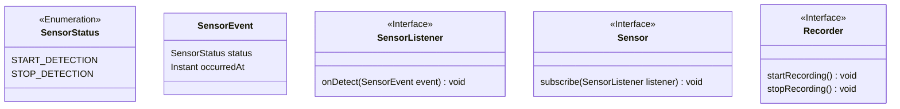

# Surveillance System

Manual Mocks are okay, but sometimes we need some extra help from third party libraries. It’s important to understand when it is okay, and when we are coupling our test definitions to the third party’s. Attendees should be able to discern when they feel more comfortable with each option.

- **Estimated time:** 2 hours
- **Format:** Pairs

## The Problem

We want to create a Surveillance System that records video when something is detected. We have purchased two devices:

- A sensor that will be able to send us an event when starts detecting, and another event when stops detecting.
- A video recorder that we can invoke via API to start and stop recording.

Test and implement the necessary code for making those components interact.

## Library Definition

> Keep in mind that we do not have any implemented third library solution, so you have to mock
